# n8n Flow Structure & System Architecture: AIVA PO-INV Matching Verification (v6.5)

> **มาตรฐานอ้างอิง:** `AH-IT-DOC-PO-INV-Matching-Standard-v6.2-DRAFT-260930-WT`  
> **Workflow Name:** `AIVA PO-INV Matching Verification v6.5`  
> **Workflow ID:** `aLUCmn3l0bZDjbVV`  
> **Canvas URL:** [http://localhost:5678/workflow/aLUCmn3l0bZDjbVV](http://localhost:5678/workflow/aLUCmn3l0bZDjbVV)  
> **Version:** 6.5.0 (ล่าสุด: จับคู่บรรทัดแบบ 8-Pass Bipartite Matcher, สลับมาใช้ "Invoice No. + Supplier Tax ID ∪ PO Number" ใน Query เดียวพร้อมตรวจจับ Intercompany ด้วย Scalar Subquery, และ Portal POST แบบไม่หยุด Flow)  
> **API Parity:** ทำงานสอดคล้องกับ Python FastAPI Engine แบบ 1:1 (`app/main.py`, `app/services/pipeline.py`, `app/core/rules.py`, `app/services/oracle_mcp.py`, `app/services/vision_extractor.py`, `app/services/portal.py`, `app/services/master_data_service.py`)

### สิ่งที่เปลี่ยนแปลงใน v6.5 ( เทียบกับ v6.4 )

| ส่วน | v6.4 | v6.5 (ปัจจุบัน = Python Parity) |
|---|---|---|
| STEP 3 Line Matching | Ladder M1/M2/M3/M4 แบบ "หาแถวแรกที่ตรง" (แถวเดียวถูกใช้ซ้ำได้ และลำดับแถว PO มีผลต่อผลลัพท์) | **8-Pass Greedy Bipartite Matcher** ตาม `evaluate_step3`: ห้ามใช้แถวใบรับซ้ำ, เรียง Pass = price+qty → price tolerance+qty → line amount → item number → price only → desc similarity → line number → แถวที่เหลือ |
| Oracle Query | Invoice+Tax เป็น Primary, `PO_NUM` เป็น Fallback แบบเงื่อนไขเดียว | ดึง **ทั้งสอง Branch ในคำสั่งเดียว** `((Invoice) AND Tax) OR (PO_NUM)` แล้วให้น้อง N7.1 คัดเลือก (Invoice ชนะเสมอ) → ได้ผลเหมือน Python ที่ยิง 2 คำสั่งแต่เหลือ Round-trip เดียว |
| Intercompany | รายการ Tax ID แบบ Hardcode | Scalar Subquery `SUPPLIER_IS_INTERNAL` จาก `apps.financials_system_params_all` (Dynamic 100%) |
| `oracle_data` ใน Table 9 | มีเฉพาะแถวที่ Active | ส่ง `receipts` = **ทุกแถว** ที่ Oracle คืนมา (`oracle_rows_all`) เหมือน `pipeline.py` และใส่ `reason` เมื่อ Bypass จาก E28 |
| Vision Prompt | Prompt สั้น + OCR fallback ที่มี `\n` แบบ escape ตกค้าง | ใช้ `SYSTEM_PROMPT` + `EXTRACTION_GUIDE` ชุดเดียวกับ `vision_extractor.py` (รวมกฎคำนวณน้ำหนัก/ม้วนเหล็ก) สร้างด้วย `join('\n')` |
| Portal POST | โฟว์หยุดทันทีถ้า Portal ตอบ error | `onError: continueRegularOutput` + `alwaysOutputData` + timeout 15s (เท่า `PORTAL_TIMEOUT_SECONDS`) → Python ไม่เคย throw จาก `PortalClient` |
| N13 | ทายชื่อแท็กจาก `decision.status` | รายงาน `portal_dispatch.status` = `SENT`/`FAILED`/`ERROR` + `paperless_update.checked_tag_id = 12` |

---

## 1. หลักการออกแบบระบบ (Core Design Principles D1–D6)

| # | หลักการ | เหตุผลและข้อกำหนดตามมาตรฐาน |
|---|---|---|
| **D1** | **AI ทำหน้าที่เพียงสกัดข้อมูล (Extraction Only)** | ให้ Vision LLM อ่านข้อความ ตัวเลข และลายเซ็นจากภาพบิล ห้าม AI คำนวณเลขคณิตหรือตัดสินผลเองเด็ดขาด เพื่อป้องกัน Hallucination และคงไว้ซึ่ง Auditability |
| **D2** | **Oracle MCP แบบ Unified All-in-One Indexed Query** | ค้นหารายการรับสินค้าแบบรวมศูนย์ด้วย `(Invoice No. + Supplier Tax ID) OR PO_NUM` ในคำสั่งเดียว รองรับ Multi-PO / Slash-variation พร้อมดึงผู้ขาย ผู้ซื้อ (`CUSTOMER_TAX_ID`) ที่อยู่จัดส่ง และธง Intercompany ในคำสั่งเดียว (< 1 วินาที) |
| **D3** | **เรียก Oracle ERP สูงสุด 1 ครั้งต่อเอกสาร** | เรียกเฉพาะเมื่อผ่าน STEP 1 และไม่พบ Exception E28 (Line Math Error) เท่านั้น; การ Fallback จาก Invoice → PO **ไม่นับเป็นครั้งที่ 2** เพราะรวมอยู่ใน Query เดียว |
| **D4** | **Oracle Dynamic 100% (No Static Master Data)** | ดึงข้อมูลนิติบุคคลผู้ซื้อ (`CUSTOMER_TAX_ID`) และที่อยู่จัดส่ง (`CUSTOMER_POSTAL`) พ่วงตรงมาจาก Oracle EBS ผ่าน `apps.financials_system_params_all` ร่วมกับ Receipt ทันที ไม่ใช้ไฟล์ static hardcoded เพื่อความแม่นยำและรองรับการเปลี่ยนแปลงขององค์กรแบบ Real-time |
| **D5** | **Output สอดคล้องตาม Table 9 เสมอ** | ส่งผลครบ 9 กฎ (V-01 ถึง V-09) หากกฎใดถูก Bypass เนื่องจาก Critical Error ให้ระบุผลเป็น `not_evaluated` |
| **D6** | **AIVA ไม่ตัดสินอนุมัติการจ่ายเงิน** | การอนุมัติตัดจ่ายเป็นหน้าที่ของฝ่ายบัญชีและ AIVA Portal; หากระบบขัดข้องต้องติดแท็ก `aiva-error` ห้ามปล่อย Auto-pass เด็ดขาด |

---

## 2. แผนภาพสถาปัตยกรรมภาพรวม (End-to-End Pipeline)

```mermaid
flowchart TD
  subgraph Ingestion["1. Ingestion & Document Selection"]
    Manual["Manual Trigger"] --> N2["N2: Get Document from Paperless<br/>(tags: 5 'invoice', excluded: 12 'check n8n')"]
    N2 --> N2_1["N2.1: Prepare Document Payload<br/>(Extract doc_id, title, OCR text)"]
    N2_1 --> N2_2{"N2.2: IF: Has Unprocessed Doc?<br/>(results.length > 0)"}
    N2_2 -- "ไม่มีเอกสารค้าง" --> MainDone["Main: Result - All Already Processed<br/>(Deduplicated 100%)"]
  end

  subgraph VisionExtraction["2. Multi-Page Vision Extraction (Standard Table 3)"]
    N2_2 -- "พบเอกสารใหม่" --> N2_3["Get a document -> PDF Convert<br/>(Render Multi-page JPEG สูงสุด 4 หน้า)"]
    N2_3 --> N2_4["N2.4: Prepare Image & Agent Payload<br/>(Embed Table 3 JSON Schema Guide & OCR Fallback)"]
    N2_4 --> N3["HTTP Request (Vision LLM)<br/>(LiteLLM Proxy: deepseek-v4-flash, json_object)"]
    N3 --> N4["N4: Code: Normalize<br/>(Table 3 Normalization, Tax ID 13 digits, UOM, Clean Date)"]
  end

  subgraph Step1Circuit["3. STEP 1: Pure Document Rules (V-01, V-02, V-03, V-06)"]
    N4 --> N5["N5: Code: STEP 1 Rules<br/>(V-01 Completeness, V-02 Line Math, V-03 Doc Math, V-06 Signatures)"]
    N5 --> N6{"N6: IF: Has E28?<br/>(|qty * unit_price - amount| > 0.50)"}
  end

  subgraph Step2_3Circuit["4. Unified Oracle ERP Integration & STEP 2-3 Rules"]
    N6 -- "ไม่พบ E28 (ปกติ)" --> N7["N7: Oracle MCP rcv_v01<br/>(Single Query: (Invoice No. + Supplier Tax) OR PO_NUM<br/>+ SUPPLIER_IS_INTERNAL scalar)"]
    N7 --> N7_1["N7.1: Parse Oracle Receipts<br/>(CSV → rows; คัด Invoice rows ก่อน, ไม่มีจึงใช้ PO rows<br/>→ oracle_query_mode: INVOICE / PO_FALLBACK / PO / NONE)"]
    N7_1 --> N8["N8: Code: STEP 2 (Receipts & ORG_ID)<br/>(V-04 Receipt Status, V-05 Master Entity Oracle 100%<br/>+ Intercompany จาก SUPPLIER_IS_INTERNAL)"]
    
    N8 --> IF_Critical{"IF: Critical Receipt Issue?<br/>(E17 No Receipt / E35 Multiple / Manual)"}
    IF_Critical -- "ปกติ" --> N9["N9: Code: STEP 3 (Line Matching Ladder)<br/>(8-Pass Bipartite Matcher: V-07, V-08 Qty, V-09 Subtotal<br/>ห้ามใช้แถวใบรับซ้ำ)"]
  end

  subgraph DecisionAndOutput["5. Decision Matrix & Paperless Tagging"]
    N6 -- "พบ E28 (Bypass Oracle)" --> N10["N10: Code: STEP 4 Decision Matrix<br/>(Auto-pass / Review / Hold / Manual Review)"]
    IF_Critical -- "พบ Critical (Bypass Line Match)" --> N10
    N9 --> N10
    
    N10 --> N11["N11: Code: Schema Validate<br/>(Assert Table 9 Compliance)"]
    N11 --> N12["N12: HTTP: POST Portal<br/>(onError: continueRegularOutput, timeout 15s<br/>→ พลาดได้แต่ไม่ทำให้งานล้มเหลว)"]
    N12 --> N13["N13: Paperless: Update Status<br/>(รายงาน portal_dispatch SENT/FAILED/ERROR + สถานะแท็ก)"]
    N13 --> N13_1["N13.1: Paperless: Add Tag to Prevent Duplicate<br/>(Append Tag ID 12 'check n8n')"]
    N13_1 --> N14["N14: Verification & Tagging Summary<br/>(Final Audit Report & Deduplication Confirmed)"]
  end
```



---

## 3. รายละเอียด Node ทั้งหมดใน Pipeline (23 Nodes)

| ลำดับ | ชื่อ Node | ชนิดของ Node (Type) | หน้าที่และความรับผิดชอบหลัก |
|:---:|---|---|---|
| **1** | `Manual Trigger` | `n8n-nodes-base.manualTrigger` | ปุ่มเริ่มต้นสำหรับการทดสอบรันด้วยมือบน Canvas |
| **2** | `N2: Get Document from Paperless` | `@mephistojb/n8n-nodes-paperless.paperless` | ดึงเอกสารจาก Paperless (กรองเฉพาะ tag ID 5 `invoice` และ **ไม่รวม** tag ID 12 `check n8n`) |
| **3** | `N2.1: Prepare Document Payload` | `n8n-nodes-base.code` | แกะออบเจกต์เอกสาร ดึง `doc_id`, `title`, `content` (OCR text) |
| **4** | `N2.2: IF: Has Unprocessed Document?` | `n8n-nodes-base.if` | ตรวจสอบว่ามีเอกสารใหม่หรือไม่ ถ้าไม่มีจะแยกไปจบงานทันที |
| **5** | `Main: Result - All Already Processed` | `n8n-nodes-base.code` | รายงานผลเมื่อไม่มีเอกสารใหม่ค้าง (ยืนยัน Deduplication 100%) |
| **6** | `Get a document` | `@mephistojb/n8n-nodes-paperless.paperless` | ดึง Binary Data ของไฟล์เอกสาร PDF จาก Paperless |
| **7** | `PDF Convert` | `n8n-nodes-pdfconvert.pdfConvert` | แปลงหน้า PDF ให้เป็นรูปภาพ Multi-page JPEG |
| **8** | `N2.4: Prepare Image & Agent Payload` | `n8n-nodes-base.code` | สร้าง `llm_user_content` แบบ Multi-modal ด้วย `EXTRACTION_GUIDE` ชุดเดียวกับ `vision_extractor.py` (**JSON Schema ตารางที่ 3** + กฎคำนวณน้ำหนักเหล็ก/ม้วน), สอด OCR fallback, จำกัด 4 หน้า (max_pages=4) |
| **9** | `HTTP Request` | `n8n-nodes-base.httpRequest` | เรียก Vision LLM (`deepseek-v4-flash`, `temperature: 0`) ผ่าน LiteLLM Proxy บังคับ `response_format: json_object`; `role: system` ใช้ข้อความ `SYSTEM_PROMPT` เดียวกับ Python (Extractor เท่านั้น ห้ามคำนวณ/ตัดสิน + กฎคำนวณน้ำหนัก) |
| **10** | `N4: Code: Normalize` | `n8n-nodes-base.code` | ล้างข้อมูล: แปลง Tax ID 13 หลัก, แปลงปี พ.ศ. เป็น ค.ศ., ปรับ Standard UOM, ผูก `doc_id` จริง |
| **11** | `N5: Code: STEP 1 Rules` | `n8n-nodes-base.code` | ประเมินกฎบริสุทธิ์: V-01 (ครบถ้วน), V-02 (เลขคณิตแถว), V-03 (เลขคณิตรวม), V-06 (ลายเซ็นผู้ส่ง/ผู้รับ) |
| **12** | `N6: IF: Has E28?` | `n8n-nodes-base.if` | ตรวจจับข้อผิดพลาดร้ายแรง E28 (Line Math) เพื่อ Bypass ไม่เรียก Oracle ตามข้อกำหนด D3 |
| **13** | `N7: Oracle MCP rcv_v01` | `n8n-nodes-base.httpRequest` | **Single Round-trip Query:** `((RCV_INV_NUM/AP_INV_NUM IN (…) AND Supplier Tax) OR PO_NUM)` รองรับ Multi-PO & Slash Variation พร้อม 2 Scalar ที่ต้องดึงพร้อม Receipt: `CUSTOMER_TAX_ID` (ผู้ซื้อ) และ `SUPPLIER_IS_INTERNAL` (สมาชิก `financials_system_params_all`) |
| **14** | `N7.1: Parse Oracle Receipts` | `n8n-nodes-base.code` | Port ของ `parse_csv_receipts`: JSON-RPC/SSE → CSV → Array (quote-aware), ทิ้งแถวที่ไม่มี `PO_NUM`/`RCV_NUM`, แล้ว **เลือกแถว Invoice ก่อน ถ้าไม่มีจึงใช้แถว PO** → ตั้ง `oracle_query_mode` = `INVOICE` / `PO_FALLBACK` / `PO` / `NONE` |
| **15** | `N8: Code: STEP 2 (Receipts & ORG_ID)` | `n8n-nodes-base.code` | Port ของ `evaluate_step2`: V-04 (ใบรับ Active 1 ใบ/ไม่มี/เกิน 50 แถว) และ V-05 (**Dynamic Oracle EBS 100%** เทียบ `receipts[0].CUSTOMER_TAX_ID` + รหัสไปรษณีย์/Location) พร้อมตั้ง `intercompany` จาก `SUPPLIER_IS_INTERNAL` และคง `oracle_rows_all` ไว้รายงานขั้นสุดท้าย |
| **16** | `IF: Critical Receipt Issue?` | `n8n-nodes-base.if` | ตรวจจับกรณีไม่มีใบรับ (E17), ใบรับซ้า (E35), หรือติดเพดาน 50 แถว (Manual Review) |
| **17** | `N9: Code: STEP 3 (Line Matching Ladder)` | `n8n-nodes-base.code` | Port ของ `evaluate_step3`: **8-Pass Greedy Bipartite Matcher** (P1 price+qty → P2 price tolerance 1%/200 + qty → P3 line amount เมื่อ subtotal ตรง → P4 item number → P5 price only → P6 desc similarity → P7 line number → P8 แถวที่เหลือ) ห้ามใช้แถวซ้ำ + เทียบ UOM ทั้งค่าดิบและค่า cleansed |
| **18** | `N10: Code: STEP 4 Decision Matrix` | `n8n-nodes-base.code` | ประเมินผลการตัดสินสุดท้าย: Auto-pass, Review, Hold, Manual Review พร้อมกำหนดผู้รับผิดชอบงาน และประกอบโครงสร้าง JSON Table 9 (`oracle_data`, `exceptions`, `evaluations`) |
| **19** | `N11: Code: Schema Validate` | `n8n-nodes-base.code` | ตรวจสอบความถูกต้องของ JSON Table 9 Output ให้ครบถ้วนตาม Standard v6.2 |
| **20** | `N12: HTTP: POST Portal` | `n8n-nodes-base.httpRequest` | ส่งผลลัพธ์ Table 9 ไปยัง AIVA Portal; ตั้ง `onError: continueRegularOutput` + `alwaysOutputData` + `timeout: 15000` เพื่อให้เหมือน `PortalClient` ที่ไม่เคย throw (Portal ล้ม = รายงาน `FAILED` แต่ Paperless ยังต้องติดแท็ก) |
| **21** | `N13: Paperless: Update Status` | `n8n-nodes-base.code` | Port ของ `update_verification_status`: สรุป `portal_dispatch.status` (`SENT`/`FAILED`/`ERROR`) และบล็อก `paperless_update` (รวม `checked_tag_id: 12` = `PAPERLESS_TAG_CHECKED_ID`) |
| **22** | `N13.1: Paperless: Add Tag to Prevent Duplicate` | `@mephistojb/n8n-nodes-paperless.paperless` | บันทึกเพิ่มแท็ก ID 12 (`check n8n`) แบบ `append_tags: true` เพื่อป้องกันการดึงซ้ำ |
| **23** | `N14: Verification & Tagging Summary` | `n8n-nodes-base.code` | สร้างสรุปผล Audit Report ปิดรอบการประมวลผลของเอกสาร |

---

## 4. โครงสร้างคำสั่ง SQL (Single Round-trip, Dual Branch)

v6.5 รวม Branch "ค้นหาด้วยเลขที่บิล" และ "ค้นหาด้วยเลขที่ PO" เข้าด้วยกันใน `WHERE` เดียว แล้วให้น้อง N7.1 เป็นผู้คัดเลือก (Invoice ชนะเสมอ) — ได้พฤติกรรมเดียวกับ `OracleMCPClient.get_receipts()` ที่ยิง 2 คำสั่ง แต่เหลือการเรียก Oracle เพียงครั้งเดียว (D3)

```sql
SELECT DISTINCT
    v.PO_NUM,
    v.RCV_NUM,
    v.RCV_INV_NUM,
    v.AP_INV_NUM,
    v.ITM_CODE,
    v.ITM_DESC,
    v.UOM,
    v.RCV_QTY,
    v.PO_UPRICE,
    (v.RCV_QTY * v.PO_UPRICE) as LINE_TOTAL,
    v.ORG_ID as INV_ORG_ID,
    ood.operating_unit as OU_ORG_ID,
    hou.name as OU_NAME,
    fsp.vat_registration_num AS CUSTOMER_TAX_ID,
    hla.postal_code as CUSTOMER_POSTAL,
    hla.location_code as CUSTOMER_LOC_CODE,
    pv.vendor_name as SUPPLIER_NAME,
    COALESCE(pv.vat_registration_num, pv.num_1099) AS SUPPLIER_TAX_ID,
    -- ธง Intercompany: เลขภาษีผู้ขายคือ Operating Unit ของกลุ่มเราเองหรือไม่
    (SELECT COUNT(*) FROM apps.financials_system_params_all fsi
      WHERE fsi.vat_registration_num = '0205553019816') as SUPPLIER_IS_INTERNAL
FROM apps.AH_DEV_RCV_PO_AP_MATCHING_V v
JOIN apps.po_vendors pv ON v.vendor_id = pv.vendor_id
LEFT JOIN apps.org_organization_definitions ood ON v.org_id = ood.organization_id
LEFT JOIN apps.hr_operating_units hou ON ood.operating_unit = hou.organization_id
LEFT JOIN apps.financials_system_params_all fsp ON ood.operating_unit = fsp.org_id
LEFT JOIN apps.hr_all_organization_units haou ON v.org_id = haou.organization_id
LEFT JOIN apps.hr_locations_all hla ON haou.location_id = hla.location_id
WHERE (
        -- Branch 1 (Primary): เลขที่บิล (ทุก variation) + เลขประจำตัวผู้เสียภาษีผู้ขาย -> index lookup
        ((v.RCV_INV_NUM IN ('SON-2609017', 'SON2609017')
       OR v.AP_INV_NUM  IN ('SON-2609017', 'SON2609017'))
         AND (COALESCE(pv.vat_registration_num, pv.num_1099) = '0205553019816'))
     OR -- Branch 2 (Fallback): เลขที่ PO จากบิล
        (v.PO_NUM = '42050734')
      )
ORDER BY v.RCV_NUM, v.ITM_CODE;
```

> ⚠️ **ข้อจำกัดทางเทคนิคที่ต้องคงไว้:**
> * ต้อง `SELECT v.ITM_CODE` เสมอ เพราะ `ORDER BY v.RCV_NUM, v.ITM_CODE` อ้างถึงมัน — ถ้าตัดออก Oracle จะคืน `ORA-01791: not a SELECTed expression` (คอลัมน์ใน `ORDER BY` ต้องอยู่ใน `SELECT DISTINCT` ด้วย)
> * ไม่ใช้ `NOT EXISTS` ใน Branch Fallback เพราะทำให้ Scan视图ทั้งก้อน (baseline ~60+ วินาที) และทำให้อายุ Query พ้น SLA — การกรองว่า "ใช้แถวไหน" ย้ายไปทำฝั่ง Client (N7.1) แทน
> * บล็อก SQL ทั้งหมดถูกสร้างใน N7 แบบ Expression (`jsonBody`) และห่อใน JSON-RPC `tools/call` ของ `sql_run`

### โหมดการค้นที่ N7.1 รายงานออกมา (`oracle_query_mode`)

| ค่า | ความหมาย | แถวที่ถูกส่งต่อไป STEP 2 |
|---|---|---|
| `INVOICE` | มีแถวที่ `RCV_INV_NUM`/`AP_INV_NUM` ตรงกับเลขบิล (+ Tax) | เฉพาะแถว Invoice |
| `PO_FALLBACK` | เลขบิลไม่ปรากฏในฝั่ง Receipt (พบบ่อยในบิลที่ยังไม่ลง AP) แต่ `PO_NUM` ถูก | แถวของ PO นั้นทั้งหมด |
| `PO` | บิลไม่ระบุเลขที่บิล/ระบุไม่ได้ แต่มี `po_number` | แถวของ PO นั้น |
| `NONE` | ไม่มีทั้ง 2 ทาง → 0 แถว | ว่าง → V-04 FAIL **E17** |

---

## 5. Master Data Entities (Oracle EBS Dynamic Architecture)

> 💡 **การปลดระวางไฟล์ Static (`master_data.py`):**  
> ปัจจุบันระบบเปลี่ยนผ่านสู่ **Oracle Dynamic 100%** โดยดึงข้อมูลนิติบุคคลทั้ง 40 Inventory Orgs และ 20 Operating Units ตรงจาก Oracle EBS ผ่าน `apps.financials_system_params_all` ร่วมกับ `apps.org_organization_definitions` แบบ Real-time ผ่าน `master_data_service.py` (แคชในหน่วยความจำและรีเฟรชทุก 1 ชม.) ทำให้ตัดปัญหาข้อมูลคลาดเคลื่อนจากการ Hardcode ได้อย่างสิ้นเชิง

> 🔁 **v6.5 — Intercompany ก็ Dynamic เช่นกัน:** ตารางด้านล่างเหลือไว้เพื่ออ้างอิงเท่านั้น ระบบไม่ได้อ่านค่าจากตารางนี้อีกต่อไป การตรวจจับ "ผู้ขายเป็นบริษัทในกลุ่ม" (Python: `invoice.supplier_tax_id in master_data_service.tax_ids_by_org()`) ทำด้วย Scalar Subquery `SUPPLIER_IS_INTERNAL` ใน N7 และ N8 แค่ตรวจ `rcvRows.some(r => r.SUPPLIER_IS_INTERNAL === true)` — รายการ `INTERNAL_TAX_IDS` แบบ Hardcode ถูกถอดออกทั้งหมด

### ตารางนิติบุคคลหลักในกลุ่มอาปิโก (จากฐานข้อมูลจริง Oracle EBS)

| Inv Org | Operating Unit | ชื่อบริษัทนิติบุคคล | เลขประจำตัวผู้เสียภาษี (Tax ID ใน EBS) | รหัสไปรษณีย์ | ที่อยู่จดทะเบียนหลัก |
|:---:|:---:|---|:---:|:---:|---|
| **101 / 102 / 103 / 104 / 222** | **101** | **บมจ. อาปิโก ไฮเทค** | **`0107545000179`** ✅ | 13160 | 99 Moo 1 Hitech Industrial Estate Banlane |
| **195 / 352** | **195** | **บจก. อาปิโก ไฮเทค ทูลลิ่ง** | **`0145548001557`** ✅ | **13160** | **99/1 Moo 1 Hitech Industrial Estate Banlane** |
| **175 / 176** | **176** | **บจก. อาปิโก ไฮเทค พาร์ท** | **`0145548001549`** ✅ | **13160** | **99/2 Moo 1 Hi-tech Industrial Estate Banlane** |
| **199 / 200** | **197** | บมจ. อาปิโก ฟอร์จจิ้ง | `0107547000354` | 20000 | 700/20 Moo 6 Amata Nakron Industrial Estate |
| **202 / 203** | **202** | บจก. อาปิโก ไอทีเอส | `0135547003157` | 13160 | 99 Moo 1 Hi-tech Industrial Estate |
| **223 / 224** | **223** | บจก. เอ แมคชั่น | `0145549002271` | 13160 | 99 Moo 1 Hi-tech Industrial Estate |
| **243 / 244** | **243** | บจก. อาปิโก มิตซุยเกะ (ประเทศไทย) | `0145549002085` | 13160 | 99 Moo 1 Hitech Industrial Estate |
| **263 / 264** | **263** | บจก. เอ อีอาร์พี | `0145553001179` | 13160 | 99 Moo 1 Hitech Industrial Estate |
| **285 / 287** | **285** | บมจ. อาปิโก พลาสติก | `0107537000131` | 10570 | 358-358/1 Moo 17 Bangplee Industrial Estate |
| **289 / 291** | **289** | บจก. อาปิโก สตรัคเจอรัล โปรดักส์ | `0205551028176` | 20000 | 700/16 Amata Nakorn Industrial Estate |
| **309 / 310** | **309** | บจก. อาปิโก อมตะ | `0105535001499` | 20160 | 700/483 AMATA NAKORN INDUSTRIAL ESTATE |
| **329 / 330** | **329** | บจก. อาปิโก ลีดเทค | `0145556001111` | 13210 | 56 Moo 9 T.Thanu A.U-Thai |
| **349 / 350** | **349** | บจก. เอ็ดชา อาปิโก ออโตโมทีฟ | `0145556001391` | 13160 | 99 Moo 1 Banlane |
| **353 / 354** | **353** | บจก. อาปิโก พรีซิชั่น | `0205557018563` | 20000 | 700/16 Moo 6 Amata Nakron Industrial Estate |
| **373 / 376** | **373** | บจก. เอเบิล มอเตอร์ส | `0135546008643` | 12120 | 14/9 MOO 14 PHAHOLYOTHIN ROAD |
| **413 / 433** | **413** | บจก. อาปิโก ไฮเทค ออโตเมชั่น | `0145563000434` | 13160 | 99 Moo 1 Ban lane |
| **453 / 454** | **453** | บจก. เอเบิล มอเตอร์ส ปากเกร็ด | `0125562036711` | 11120 | 38/83 Moo 5 Tiwanon Road |
| **473 / 474** | **473** | บจก. เอเบิล มอเตอร์ส ปทุมธานี | `0135562027568` | 12000 | 88 Moo 5 Sai Bang Bua Thong |
| **475 / 495** | **475** | บจก. อาปิโก ไบค์ | `0145553001829` | 13160 | 99 Moo 1 Hi-tech Industrial Estate |
| **535 / 536** | **535** | บจก. เอเบิล อีวี | `0135566030351` | 12120 | 14/9 Moo 14 Phaholyothin Road |
| **555 / 556** | **555** | บจก. เอ็มจี เอเบิล มอเตอร์ส | `0135564010484` | 12000 | 88 Moo 5 Bang Bua Thong |
| **596 / 615** | **596** | AAPICO AVEE SDN. BHD. | `200301017448(619868-V)` | 35900 | Lot No 17 Jalan Jelawai 1 Proton City |

---

## 6. กฎการตรวจสอบ 9 ข้อ (Validation Rules V-01 ถึง V-09)

| รหัสกฎ | ชื่อกฎการตรวจสอบ | ข้อกำหนดและการคำนวณ | Exception Code | Severity |
|:---:|---|---|:---:|:---:|
| **V-01** | Pure Document Completeness | ตรวจสอบฟิลด์จำเป็น 8 ฟิลด์ครบ และ `pages_complete == true` | **E13** | Medium |
| **V-02** | Line Math Check | ตรวจสอบ $\|(\text{qty} \times \text{unit\_price}) - \text{amount}\| \le 0.50$ | **E28** | High *(Halt)* |
| **V-03** | Document Math Check | ตรวจสอบผลรวมบรรทัดกับ Subtotal, VAT 7%, และ Grand Total | **E31 / E16** | High / Low |
| **V-04** | Oracle Receipt Active Check | ตรวจสอบการพบใบรับสินค้าใน Oracle ERP โดยต้องมีใบรับที่ active เพียง 1 ใบ | **E17 / E35** | High |
| **V-05** | Customer Entity & Tax ID Match | เทียบ Tax ID ลูกค้า 13 หลัก กับ `receipts[0].CUSTOMER_TAX_ID` จาก Oracle EBS และตรวจที่อยู่/รหัสไปรษณีย์ พร้อมตรวจ Intercompany อัตโนมัติ | **E09** | High / Med |
| **V-06** | Signatures Verification | ตรวจสอบการพบลายเซ็นผู้รับของ (Receiver) และผู้ส่งของ (Supplier) | **E26** | High / Med |
| **V-07** | Line Matching Ladder | จับคู่บรรทัดบิล↔ใบรับด้วย 8-Pass Bipartite Matcher (ห้ามใช้แถวซ้ำ) แล้วเทียบราคา (tolerance 1% และ ≤ 200 บาท) และ UOM ทั้งค่าดิบ/cleansed | **E05 / E29 / E30 / E12** | High / Med / Low |
| **V-08** | Quantities Check | ตรวจสอบยอดวางบิลเทียบยอดรับสินค้าจริง ห้ามเกินยอดรับ | **E06 / E34** | High / Med |
| **V-09** | Total Amount Check | ตรวจสอบยอดรวมมูลค่าบิลเทียบกับยอดรวมมูลค่าใบรับสินค้าใน Oracle | **E31** | High |

---

## 7. กรณีศึกษาผลการทดสอบจริง (Live Verification Cases)


### กรณีศึกษาที่ 1: บิล Single-PO (Doc 114, PO 42050734)
* **ผู้ขาย:** SON AUTO ENGINEERING CO., LTD (`0205553019816`)
* **Invoice No:** `SON-2609017`
* **ผู้ซื้อ:** บจก. อาปิโก ไฮเทค ทูลลิ่ง (`0145548001557`, Org ID: 352)
* **ผลลัพธ์:** **Auto-pass (100% Pass, 0 Exceptions)** ทุกกฎ V-01 ถึง V-09 ผ่านเกณฑ์สมบูรณ์แบบ

### กรณีศึกษาที่ 2: บิล Multi-PO ครอบคลุม 3 POs ในบิลเดียว (Invoice SQ26/085013)
* **ผู้ขาย:** JAROONRAT PRODUCTS CO., LTD. (`0135537003456`)
* **Invoice No:** `SQ26/085013`
* **ผู้ซื้อ:** บจก. อาปิโก ไฮเทค พาร์ท (`0145548001549`, Org ID: 175, OU: 176)
* **PO ที่เกี่ยวข้อง:** 3 POs (`43026973`, `43041729`, `43043027`)
* **ผลลัพธ์:** **Auto-pass (100% Pass, 0 Exceptions)** ใน Query เดียว (ใช้เวลา < 1 วินาที)
  - Line 1: `POP3000263A` | PO 43026973 | 789.60 บาท
  - Line 2: `POP3000311A` | PO 43041729 | 4,005.20 บาท
  - Line 3: `POP3000433A` | PO 43043027 | 607.20 บาท
  - Subtotal รวม: 5,402.00 บาท | VAT 7%: 378.14 บาท | ยอดสุทธิรวม: 5,780.14 บาท (ตรงกับบิลและ AP 100%)

### กรณีศึกษาที่ 3: บิล AAPICO Hitech PCL (Doc 15, Invoice SQ26/071249)
* **ผู้ขาย:** JAROONRAT PRODUCTS CO., LTD. (`0135537003456`)
* **Invoice No:** `SQ26/071249` (Slash-variant matching: `SQ26/071249` / `SQ26071249`)
* **ผู้ซื้อ:** บมจ. อาปิโก ไฮเทค (`0107545000179`, Org ID: 103, OU: 101)
* **PO ที่เกี่ยวข้อง:** PO `41031383` (Receipt `11030062`)
* **ผลลัพธ์:** **Auto-pass (100% Pass, 0 Exceptions)** 
  - Dynamic Tax ID จาก Oracle EBS: `0107545000179` ตรงกับเลข 13 หลักบนหัวบิล
  - V-05: PASS (Matched branch 00003, OU: AH - Aapico Hitech)
  - V-07 ถึง V-09: รายการอะไหล่ตรงกับใบรับสินค้า ยอดเงินรวม 3,248.52 บาท ตรงกัน 100%

---

## 8. ตารางเทียบ Python ↔ n8n (Engine Parity Map)

> n8n Flow ถูกออกแบบให้เป็นอีก Runtime หนึ่งของ Engine เดียวกัน ดังนั้นตรรกะทุกจุดต้องอ้างอิงไฟล์ Python เป็นต้นแบบ และชื่อฟิลด์ใน n8n ต่างจาก Python (`lines[]` ไม่ใช่ `po_lines[]`, `invoice.po_number` ไม่ใช่ `mergedFields.po_number`, `oracle_rcv_rows[]` ไม่ใช่ `oracle_data.rows[]`)

| ต้นฉบับ Python | Node ใน n8n | ผลลัพธ์ที่ต้องเท่ากัน |
|---|---|---|
| `vision_extractor.SYSTEM_PROMPT` | `HTTP Request` → `jsonBody` (`role: system`) | ข้อความ Extractor-only + กฎคำนวณน้ำหนัก/ม้วนเหล็ก |
| `vision_extractor.EXTRACTION_GUIDE` + `build_user_content()` | `N2.4: Prepare Image & Agent Payload` | Schema ตารางที่ 3 + OCR fallback + ภาพสูงสุด 4 หน้าง |
| `rules.normalize_extracted_document()` + `clean_uom/clean_tax_id/clean_po_number/clean_date` | `N4: Code: Normalize` | ฟิลด์ตั้งต้น + alias สำรอง + UOM synonym table |
| `rules.evaluate_step1()` | `N5: Code: STEP 1 Rules` | V-01, V-02 (E28 halt), V-03 (±1.00 VAT), V-06 |
| `oracle_mcp.build_receipts_sql()` (Invoice แล้วค่อย PO) | `N7: Oracle MCP rcv_v01` (Branch รวม) + `N7.1` (ลำดับความสำคัญ) | แถวผลลัพธ์ชุดเดียวกัน, 1 round-trip |
| `oracle_mcp.parse_csv_receipts()` | `N7.1: Parse Oracle Receipts` | Quote-aware CSV, ทิ้งแถวที่ไม่มี PO/RCV, `no rows selected` → 0 แถว |
| `master_data_service.tax_ids_by_org()` | Scalar `SUPPLIER_IS_INTERNAL` ใน N7 | ธง Intercompany เท่ากันโดยไม่ต้องมี Static List |
| `rules.evaluate_step2()` | `N8: Code: STEP 2` | V-04 (E17/E35/Safety cap 50), V-05 (E09), `intercompany` |
| `rules.evaluate_step3()` | `N9: Code: STEP 3` | 8 Pass เรียงลำดับเดียวกัน, V-07/V-08/V-09 และรหัส Exception ตรงกัน |
| `rules.evaluate_step4_decision()` + `pipeline.py` ประกอบ `oracle_data` | `N10: Code: STEP 4 Decision Matrix` | 9 กฎครบ, status/assigned_to, `oracle_data.receipts` ครบทุกแถว |
| `pipeline.validate_output()` | `N11: Code: Schema Validate` | 9 กฎ, `decision.status` ใน set, รหัส E* อยู่ในรายการอนุญาต |
| `portal.PortalClient.post_verification_result()` (timeout 15s, ไม่ throw) | `N12: HTTP: POST Portal` | Flow ไปต่อได้เสมอแม้ Portal ล้ม |
| `paperless.PaperlessClient.update_verification_status()` (tag 12) | `N13` + `N13.1: Paperless: Add Tag…` | `portal_dispatch` + `paperless_update.checked_tag_id = 12` |

---

## 9. การทดสอบ Regression แบบ Offline ของ v6.5

เนื่องจาก Flow เชื่อมกับ Paperless / LiteLLM / Oracle MCP จริง การตรวจตรรกะทำด้วย Harness  ในเครื่อง (`tmp/run_flow_sim.js`) ซึ่ง **อ่าน `jsCode` จาก Workflow ที่ Export จริง** แล้วรัน N4 → N5 → N7.1 → N8 → N9 → N10 → N11 กับข้อมูลจำลอง ผลลัพธ์:

| เคส | สถานการณ์ | ผลลัพธ์ที่ได้ | ตรงตาม Python |
|:---:|---|---|:---:|
| 1 | แถว Invoice ตรงทุกตัว | `INVOICE`, 2 แถว, **Auto-pass**, 0 Exceptions | ✅ |
| 2 | เลขบิลไม่อยู่ใน Receipt → ใช้แถว PO | `PO_FALLBACK`, 2 แถว, **Auto-pass** | ✅ |
| 3 | `amount ≠ qty × price` | V-02 FAIL **E28**, Oracle Bypass (`queried=false`, reason ชัด), `Hold → accounting`, V-04…V-09 = `not_evaluated` | ✅ |
| 4 | Oracle ไม่มีแถว | V-04 FAIL **E17**, V-05 ไม่ถูกประเมิน, `Hold → user` | ✅ |
| 5 | วางบิลเกินยอดรับ | V-08 FAIL **E06**, `Hold → user` | ✅ |
| 6 | พบ 2 ใบรับในบิลเดียว | V-04 FAIL **E35** (ข้าม STEP 3), `Hold → user` | ✅ |
| 7 | ผู้ขายเป็นบริษัทในกลุ่ม + ขาดลายเซ็นผู้รับ | `intercompany=true`, V-06 FAIL **E26**, `Hold → user` | ✅ |

> ทุกเคสผ่าน `N11: Schema Validate` (ไม่ throw) และ `jsCode` ของทั้ง 12 Code Node ผ่านการตรวจไวยากรณ์ด้วย `node --check`

---

## 10. บันทึกการอัปเดตผ่าน MCP (v6.5)

* Workflow `aLUCmn3l0bZDjbVV` ถูกอัปเดตด้วย `aiva-n8n_update_workflow` (Atomic, ไม่ทำขณะ `active: false`) — 23 Nodes คงเดิม, ไม่มีการแก้ Connection
* Node ที่แก้: `N2.4`, `HTTP Request`, `N4`, `N7` (`jsonBody`), `N7.1`, `N8`, `N9`, `N10`, `N12` (settings + options), `N13`
* Node ที่ **ไม่ได้แก้** เพราะตรงกับ Python แล้ว: `N5: Code: STEP 1 Rules`, `N11: Code: Schema Validate`
* ชื่อ Workflow เปลี่ยนจาก `… v6.2` → `AIVA PO-INV Matching Verification v6.5`
* ⚠️ **ข้อควรระวังของ MCP Tool:** `setNodeParameter.path` เป็น JSON Pointer **สัมพัทธ์กับ `parameters`** — ต้องเขียน `/jsCode`, `/jsonBody`, `/options` (การเขียน `/parameters/jsCode` จะไปสร้างคีย์ `parameters.parameters.jsCode` แทน)

