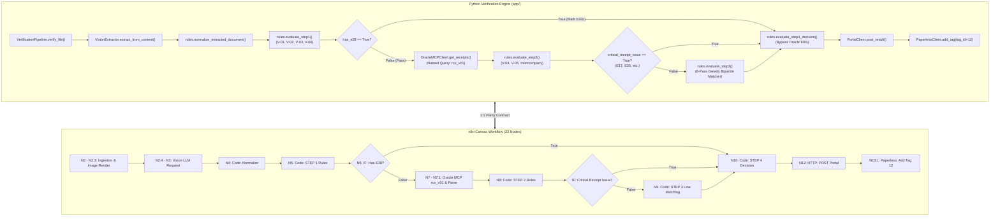

# AIVA PO-INV Matching: Python App <-> n8n Workflow 1:1 Parity Specification Matrix

> **Document Version:** 1.0.0  
> **Target n8n Workflow:** `AIVA PO-INV Matching Verification v6.5` (ID: `aLUCmn3l0bZDjbVV`)  
> **Target Python Engine:** FastAPI Engine (`app/services/pipeline.py`, `app/core/rules.py`, `app/services/oracle_mcp.py`, `app/services/vision_extractor.py`, `app/services/portal.py`)  
> **Standard:** `AH-IT-DOC-PO-INV-Matching-Standard-v6.2-DRAFT-260930-WT`

---

## 1. Architectural Alignment Overview

ระบบ AIVA PO-INV Matching Verification ถูกออกแบบภายใต้หลักการ **Dual-Circuit Parity (1:1)** เพื่อให้ผลลัพธ์การประเมินใบแจ้งหนี้/ใบส่งสินค้าระหว่าง **Python Production API Service** และ **n8n Automation Workflow Canvas** ตรงกัน 100% โดยมีการแบ่งขั้นตอนหลัก 4 ขั้นตอน (Steps 1–4) พร้อม Branching Conditions ที่ตรงกันทุกจุด



---

## 2. Node-by-Node Parity Mapping Table

| Sequence | Python Implementation | n8n Node ID & Name | Type | หน้าที่หลักและ Data Contract |
|:---:|---|---|---|---|
| **01** | `app/api/routes.py:verify_file()` | `Manual Trigger` | Trigger | จุดเริ่มต้นรับคำสั่งประมวลผล (Manual / Webhook) |
| **02** | `app/services/paperless.py:get_documents()` | `N2: Get Document from Paperless` | Paperless Node | ดึงเอกสารคิวที่มี tag ID 5 (`invoice`) และไม่มี tag ID 12 (`check n8n`) |
| **03** | `pipeline.py:verify_paperless_document()` | `N2.1: Prepare Document Payload` | Code Node | ดึง `doc_id`, `title`, `content` (OCR Text) |
| **04** | Queue Check Logic | `N2.2: IF: Has Unprocessed Document?` | IF Node | ตรวจสอบว่ามีเอกสารใหม่หรือไม่ ถ้าไม่มีจบงานทันที |
| **05** | Empty queue response | `Main: Result - All Already Processed` | Code Node | สรุปผลกรณีไม่มีเอกสารตกค้าง (Deduplication 100%) |
| **06** | `paperless.py:download_document_bytes()` | `Get a document` | Paperless Node | ดึง Binary PDF ของเอกสารจาก Paperless-ngx |
| **07** | `vision_extractor.py:pdf_to_images()` | `PDF Convert` | PDF Convert Node | แปลง PDF เป็นภาพ JPEG/PNG สูงสุด 4 หน้า (300 DPI) |
| **08** | `vision_extractor.py:build_user_content()` | `N2.4: Prepare Image & Agent Payload` | Code Node | สอด Table 3 JSON Schema Guide, กฎคำนวณน้ำหนักม้วนเหล็ก, และ OCR Fallback Text |
| **09** | `vision_extractor.py:extract_from_content()` | `HTTP Request (Vision LLM)` | HTTP Request | เรียก LiteLLM Proxy (`deepseek-v4-flash`), `response_format: json_object`, `temp: 0` |
| **10** | `rules.py:normalize_extracted_document()` | `N4: Code: Normalize` | Code Node | Clean Tax ID (13 หลัก), UOM mapping, วันที่ พ.ศ. -> ค.ศ., ปรับโครงสร้าง Table 3 |
| **11** | `rules.py:evaluate_step1()` | `N5: Code: STEP 1 Rules` | Code Node | ประเมิน V-01 (ความครบถ้วน), V-02 (Line Math), V-03 (Doc Math), V-06 (Signatures) |
| **12** | `pipeline.py:execute_matching_engine()` | `N6: IF: Has E28?` | IF Node | ตรวจจับข้อผิดพลาด `E28` (`abs(qty * price - amount) > 0.50`) เพื่อ Bypass Oracle |
| **13** | `oracle_mcp.py:get_receipts()` | `N7: Oracle MCP rcv_v01` | HTTP / MCP Node | ยิง Named Query `rcv_v01` ค้นหา `(Invoice+Tax) OR PO_NUM` พร้อมดึง `SUPPLIER_IS_INTERNAL` |
| **14** | `oracle_mcp.py:_parse_csv_to_receipts()` | `N7.1: Parse Oracle Receipts` | Code Node | แปลง CSV เป็น Receipt Objects, เลือกระหว่าง Invoice rows และ PO fallback rows |
| **15** | `rules.py:evaluate_step2()` | `N8: Code: STEP 2 (Receipts & ORG_ID)` | Code Node | ประเมิน V-04 (Receipt Status), V-05 (Customer Entity & Postal dynamic match), Intercompany |
| **16** | `pipeline.py:execute_matching_engine()` | `IF: Critical Receipt Issue?` | IF Node | ตรวจจับ `E17` (ไม่พบใบรับ), `E35` (หลายใบรับชนกัน) เพื่อ Bypass Step 3 |
| **17** | `rules.py:evaluate_step3()` | `N9: Code: STEP 3 (Line Matching Ladder)` | Code Node | **8-Pass Greedy Bipartite Matcher**: V-07, V-08 (Qty), V-09 (Subtotal) |
| **18** | `rules.py:evaluate_step4_decision()` | `N10: Code: STEP 4 Decision Matrix` | Code Node | ตัดสินผลตาม Table 9: Auto-pass / Review / Hold / Manual Review, จัดกลุ่ม Exceptions |
| **19** | `models.py:Table9Output` validation | `N11: Code: Schema Validate` | Code Node | ตรวจสอบความถูกต้องของ JSON Table 9 (9 กฎครบ, status ถูกต้อง, reason พร้อม) |
| **20** | `portal.py:post_verification_result()` | `N12: HTTP: POST Portal` | HTTP Request | POST ไปยัง Portal (`onError: continueRegularOutput`, timeout 15s) |
| **21** | `pipeline.py:verify_paperless_document()` | `N13: Paperless: Update Status` | Code Node | บันทึกสถานะ Portal Dispatch (SENT / FAILED / ERROR) |
| **22** | `paperless.py:add_tag(tag_id=12)` | `N13.1: Paperless: Add Tag to Prevent Duplicate` | Paperless Node | ติด Tag 12 (`check n8n`) ป้องกันการวนซ้ำ |
| **23** | `pipeline.py` return summary | `N14: Verification & Tagging Summary` | Code Node | สรุปผลการตรวจสอบรอบสุดท้าย และบันทึก Audit Log |

---

## 3. Node Logic & JavaScript Snippet Equivalents (For Applying into n8n)

### 3.1 N5: STEP 1 Rules (`evaluate_step1`)
```javascript
// n8n Node: N5 Code Node (JavaScript equivalent of rules.evaluate_step1)
const doc = items[0].json;
const rules = [];
const exceptions = [];
let has_e28 = false;

// V-01: Document Completeness
const missing_header = [];
if (!doc.invoice.invoice_num) missing_header.push('invoice_num');
if (!doc.invoice.invoice_date) missing_header.push('invoice_date');
if (!doc.invoice.supplier_tax_id) missing_header.push('supplier_tax_id');
if (!doc.invoice.customer_name && !doc.invoice.customer_tax_id) missing_header.push('customer');

if (missing_header.length > 0) {
  rules.push({ rule_id: 'V-01', rule_name: 'Document Completeness', status: 'FAIL', reason: `Missing: ${missing_header.join(', ')}` });
  exceptions.push({ code: 'E01', message: `Missing required fields: ${missing_header.join(', ')}` });
} else {
  rules.push({ rule_id: 'V-01', rule_name: 'Document Completeness', status: 'PASS', reason: 'All required headers present' });
}

// V-02: Line Math Integrity
for (const line of (doc.lines || [])) {
  const calc = Math.round(line.quantity * line.unit_price * 100) / 100;
  if (Math.abs(calc - line.amount) > 0.50) {
    has_e28 = true;
    exceptions.push({ code: 'E28', message: `Line ${line.line_number} math mismatch: ${line.quantity} * ${line.unit_price} = ${calc} != ${line.amount}` });
  }
}
rules.push({
  rule_id: 'V-02',
  rule_name: 'Line Math Integrity',
  status: has_e28 ? 'FAIL' : 'PASS',
  reason: has_e28 ? 'Detected line math mismatch (> 0.50 THB)' : 'All lines math check passed'
});

return [{ json: { ...doc, step1_rules: rules, step1_exceptions: exceptions, has_e28: has_e28 } }];
```

### 3.2 N9: STEP 3 Line Matching (`evaluate_step3`) - 8-Pass Greedy Bipartite Matcher
```javascript
// n8n Node: N9 Code Node (8-Pass Greedy Bipartite Matcher)
const data = items[0].json;
const inv_lines = data.lines || [];
const po_receipts = data.oracle_receipts || [];

// สำคัญ: ห้ามใช้แถวใบรับซ้ำ (No receipt row reused)
const matched_receipt_ids = new Set();
const line_matches = [];

function find_receipt(predicate) {
  for (let i = 0; i < po_receipts.length; i++) {
    if (!matched_receipt_ids.has(i) && predicate(po_receipts[i])) {
      matched_receipt_ids.add(i);
      return po_receipts[i];
    }
  }
  return null;
}

// วนจับคู่ 8 ระดับตามมาตรฐาน
for (const line of inv_lines) {
  let matched = null;
  // Pass 1: exact price and qty
  matched = find_receipt(r => Math.abs(r.UNIT_PRICE - line.unit_price) < 0.01 && Math.abs(r.QUANTITY_RECEIVED - line.quantity) < 0.001);
  // Pass 2: price within tolerance (1% or 200 THB) & exact qty
  if (!matched) matched = find_receipt(r => Math.abs(r.UNIT_PRICE - line.unit_price) <= Math.max(200, line.unit_price * 0.01) && Math.abs(r.QUANTITY_RECEIVED - line.quantity) < 0.001);
  // Pass 3: line amount match
  if (!matched) matched = find_receipt(r => Math.abs((r.UNIT_PRICE * r.QUANTITY_RECEIVED) - line.amount) < 1.0);
  // Pass 4: item number match
  if (!matched && line.item_number) matched = find_receipt(r => r.ITEM_NUMBER && r.ITEM_NUMBER.trim() === line.item_number.trim());
  // Pass 5: price match only
  if (!matched) matched = find_receipt(r => Math.abs(r.UNIT_PRICE - line.unit_price) < 0.01);
  // Pass 6: line number match
  if (!matched) matched = find_receipt(r => String(r.LINE_NUM) === String(line.line_number));
  // Pass 7 & 8: fallback to remaining
  if (!matched) matched = find_receipt(() => true);

  line_matches.push({ line_number: line.line_number, matched_receipt: matched });
}

return [{ json: { ...data, line_matches } }];
```

---

## 4. Verification Checkpoints for Synchronization

เมื่อมีการปรับปรุง Python Engine ให้ตรวจสอบ 3 จุดนี้ก่อนนำไปแก้บน n8n เสมอ:
1. **Error Codes (E01–E35):** ห้ามสร้างรหัส Error ใหม่โดยไม่ผ่านความเห็นชอบ และต้องให้ตรงกับ `tests/test_suite.py:COVERED_CODES`
2. **Oracle EBS Query Parity:** ตรวจสอบว่าคำสั่ง `rcv_v01` ยังคงดึงใน 1 Single Round-trip และนำ `CUSTOMER_TAX_ID` และ `SUPPLIER_IS_INTERNAL` ออกมาเสมอ
3. **Receipt Row Deduplication:** ตรวจสอบว่าไม่มี Node ใดใน n8n ที่อนุญาตให้นำ Receipt Row เดียวกันไป Match ซ้ำกับหลาย Invoice Line
