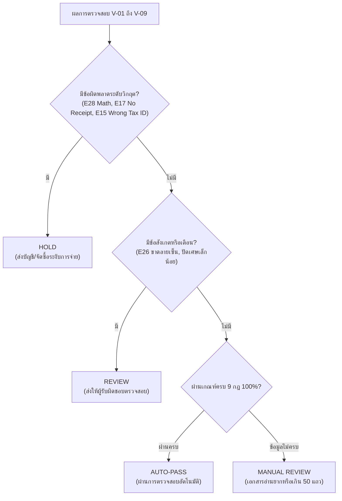

# Matching Rules & Standard Specification (Standard v6.2)

> **มาตรฐานอ้างอิง:** `AH-IT-DOC-PO-INV-Matching-Standard-v6.2-DRAFT-260930-WT`  
> **ไฟล์โค้ดหลัก:** [`OCR service/n8n/app/core/rules.py`](file:///c:/Users/aapico.intern07/Documents/invoice/ai-invoice-matching/OCR%20service/n8n/app/core/rules.py) และ [`OCR service/n8n/app/core/master_data.py`](file:///c:/Users/aapico.intern07/Documents/invoice/ai-invoice-matching/OCR%20service/n8n/app/core/master_data.py)

---

## 1. หลักการออกแบบระบบ (Core Design Principles D1–D6)

| หลักการ | คำอธิบายและข้อกำหนด |
|---|---|
| **D1: Extraction Only** | AI (Vision LLM) ทำหน้าที่เพียงอ่านตัวอักษร ตัวเลข และดูลายเซ็นจากภาพ ห้ามคำนวณเลขคณิตหรือตัดสินผลเองเด็ดขาด เพื่อป้องกัน AI Hallucination |
| **D2: Oracle MCP Unified Query** | ค้นหาใบรับสินค้าจาก Oracle ERP โดยค้นหาหลักด้วย `Supplier Tax ID + Invoice Number` (รองรับ Multi-PO ใน 1 บิล) และ Fallback ด้วย `PO_NUM` |
| **D3: At Most Once Oracle Query** | เรียก Oracle ERP สูงสุด 1 ครั้งต่อเอกสาร และข้ามการเรียกทันทีหากพบความผิดพลาดเลขคณิตในระดับแถว (E28) |
| **D4: Master Data 100% Exact Match** | ตรวจสอบนิติบุคคลผู้ซื้อกับ Master Data 27 บริษัทในเครือ AAPICO (Tax ID 13 หลัก, Org ID, ที่อยู่ และรหัสไปรษณีย์) |
| **D5: Table 9 Standard Output** | ส่งออกผลลัพธ์ครบทั้ง 9 กฎ (V-01 ถึง V-09) หากกฎใดถูก Bypass เนื่องจาก Critical Error ให้ระบุสถานะเป็น `not_evaluated` |
| **D6: Auditability & Fail-Safe** | หากระบบเกิดขัดข้อง ห้ามปล่อย Auto-pass เด็ดขาด ให้ติดแท็ก `aiva-error` หรือส่งเข้า Manual Review |

---

## 2. กฎการตรวจสอบ 9 ข้อ (Validation Rules V-01 ถึง V-09)

### STEP 1: กฎการตรวจเอกสารในตัวเอง (Pure Document Rules)
ทำงานบนข้อมูลที่อ่านได้จากบิลโดยตรง ไม่ต้องพึ่งพาข้อมูลภายนอก

- **V-01: Header Completeness (ความครบถ้วนของข้อมูลหัวเอกสาร)**
  - ต้องมีเลขที่ใบแจ้งหนี้ (`invoice_number`), เลขที่ใบสั่งซื้อ (`po_number`), วันที่เอกสาร (`invoice_date`), เลขผู้เสียภาษีผู้ขาย (`supplier_tax_id`), และผู้ซื้อ (`customer_tax_id`)
  - หากขาดข้อมูลสำคัญ จะติดรหัสข้อยกเว้น เช่น `E05`, `E06`, `E07`, `E08`, `E09`
- **V-02: Line Math Consistency (ความถูกต้องของเลขคณิตแต่ละบรรทัด)**
  - ทุกบรรทัดต้องเป็นไปตามสมการ: $|(Quantity \times Unit Price) - Line Total| \le 0.50$
  - หากผลต่างเกิน 0.50 บาท จะติดรหัส **`E28` (Line Math Error)** ถือเป็น Critical Error และจะ Bypass การเรียก Oracle ERP (ตามหลัก D3)
- **V-03: Document Math Consistency (ความถูกต้องของยอดรวมทั้งบิล)**
  - ตรวจสอบยอดรวม: $|Subtotal + VAT - Grand Total| \le 1.00$
  - ตรวจสอบอัตราภาษีมูลค่าเพิ่ม: $|Subtotal \times 0.07 - VAT| \le 1.00$
  - หากไม่ตรง จะติดรหัส `E27` หรือ `E29`
- **V-06: Delivery & Signatures Verification (ลายเซ็นและหลักฐานการรับมอบ)**
  - ตรวจสอบการมีอยู่ของลายเซ็นผู้ส่งของและลายเซ็นผู้รับของบนเอกสาร
  - หากขาดลายเซ็น จะติดรหัส `E26`

---

### STEP 2: กฎการตรวจสอบสถานะใบรับและนิติบุคคล (ERP Receipt & Entity Rules)
ทำงานร่วมกับข้อมูลจาก Oracle EBS และ Master Data

- **V-04: Receipt Status in Oracle ERP (การมีอยู่ของใบรับสินค้า)**
  - ตรวจสอบว่าพบ Goods Receipt ใน Oracle EBS หรือไม่
  - หากไม่พบ จะติดรหัส **`E17` (No Receipt Found)**
  - หากพบใบรับสินค้าซ้ำซ้อนผิดปกติ จะติดรหัส `E35`
- **V-05: Customer Master Entity Verification (การตรวจสอบนิติบุคคลผู้ซื้อ)**
  - ตรวจสอบเลขประจำตัวผู้เสียภาษี 13 หลักของผู้ซื้อเทียบกับ Master Data 27 บริษัท AAPICO
  - ตรวจสอบความถูกต้องของ Inventory Organization ID (`INV_ORG_ID`), Operating Unit (`OU_ORG_ID`), และที่อยู่จัดส่ง
  - หาก Tax ID ไม่ตรงกับทะเบียน หรือระบุบริษัทผิด จะติดรหัส `E15` หรือ `E16`

---

### STEP 3: กฎการจับคู่บรรทัดสินค้า (Item Ladder Matching Rules)
จับคู่รายการสินค้าแต่ละบรรทัดในบิลกับรายการรับสินค้าใน Oracle Receipt

- **V-07: Item Line Matching (การจับคู่รหัสสินค้าแบบขั้นบันได)**
  - **Match Method 1 (M1 - Exact Item Code)**: จับคู่ด้วย Part Number / Item Code ตรงกัน 100%
  - **Match Method 2 (M2 - PO Line Number)**: หาก Item Code ไม่ตรง ให้จับคู่ด้วยเลขบรรทัด PO Line
  - **Match Method 3 (M3 - Description Similarity)**: จับคู่ด้วยคำอธิบายรายการสินค้า (ความคล้ายคลึงของข้อความ)
  - หากไม่สามารถจับคู่รายการใดได้ จะติดรหัส `E19` (Item Code Mismatch)
- **V-08: Quantity Verification (การตรวจสอบจำนวนรับ)**
  - จำนวนที่เรียกเก็บในบิลต้องไม่เกินจำนวนที่รับจริงใน ERP: $Invoice Qty \le ERP Received Qty$
  - หากเรียกเก็บเกินจำนวนที่รับ จะติดรหัส **`E21` (Over-billed Quantity)**
- **V-09: Unit Price & Subtotal Verification (การตรวจสอบราคาต่อหน่วยและยอดรวม)**
  - ราคาต่อหน่วยต้องตรงกับราคาใน PO / Receipt (ยอมรับผลต่าง $\le 0.05$ บาท)
  - หากราคาในบิลสูงกว่าในระบบ จะติดรหัส **`E22` (Price Variance)**

---

## 3. เมทริกซ์การตัดสินผล (STEP 4: Decision Matrix)

ระบบจะสรุปสถานะการตรวจสอบออกเป็น 4 รูปแบบ:



| สถานะ (Status) | คำอธิบาย | แอ็กชันถัดไป | ผู้รับผิดชอบ (Routed To) |
|---|---|---|---|
| **`auto_pass`** | ข้อมูลและเลขคณิตตรงกับ Oracle ERP 100% ครบถ้วน | ส่งต่อไปบันทึกตัดจ่าย | ระบบอัตโนมัติ |
| **`review`** | ผ่านเกณฑ์หลัก แต่มีข้อสังเกตเล็กน้อย (เช่น ลายเซ็นไม่ชัด) | ตรวจสอบยืนยันเพิ่มเติม | `accountant` / `ap_officer` |
| **`hold`** | บิลผิดพลาดรุนแรง (ยอดไม่ตรง, ไม่มีการรับของ, Tax ID ผิด) | ระงับการจ่ายเงิน | `buyer` / `supplier` / `accountant` |
| **`manual_review`** | รายการเกินเพดาน (เช่น > 50 รายการ) หรือระบบขัดข้อง | ตรวจสอบด้วยคนแบบ 100% | `accountant` |

---

## 4. ตารางรหัสข้อยกเว้นและข้อผิดพลาด (Exception Codes Reference)

| รหัส | หมวดหมู่ | ความหมาย | ระดับความรุนแรง |
|---|---|---|---|
| **`E05`** | Header | ไม่พบเลขที่ใบกำกับภาษี / ใบแจ้งหนี้ | Critical |
| **`E06`** | Header | ไม่พบเลขที่ใบสั่งซื้อ (PO Number) | High |
| **`E07`** | Header | ไม่พบวันที่เอกสาร | Medium |
| **`E08`** | Header | ไม่พบเลขประจำตัวผู้เสียภาษีของผู้ขาย (13 หลัก) | Critical |
| **`E09`** | Header | ไม่พบเลขประจำตัวผู้เสียภาษีของผู้ซื้อ | Critical |
| **`E15`** | Entity | เลขประจำตัวผู้เสียภาษีของผู้ซื้อไม่ตรงกับ Master Data 27 บริษัท | Critical |
| **`E16`** | Entity | ที่อยู่ผู้ซื้อหรือสาขาไม่ตรงกับทะเบียนนิติบุคคล | Medium |
| **`E17`** | Receipt | ไม่พบใบรับสินค้า (Goods Receipt) ใน Oracle EBS | Critical |
| **`E19`** | Matching | รหัสสินค้าหรือคำอธิบายสินค้าไม่ตรงกับใบรับสินค้า | High |
| **`E21`** | Quantity | จำนวนสินค้าในบิลเกินจำนวนที่รับจริงในระบบ ERP | Critical |
| **`E22`** | Price | ราคาต่อหน่วยในบิลสูงกว่าราคาใน PO / Receipt | Critical |
| **`E26`** | Signature | ขาดลายเซ็นผู้รับสินค้าหรือผู้ส่งสินค้า | Medium |
| **`E27`** | Math | อัตราภาษีมูลค่าเพิ่มหรือยอดคำนวณ VAT 7% ไม่ถูกต้อง | High |
| **`E28`** | Math | **Line Math Error:** ยอดเงินต่อแถว ($Qty \times Price \ne Line Total$) | **Critical (Bypass ERP)** |
| **`E29`** | Math | ยอดรวมทั้งเอกสาร ($Subtotal + VAT \ne Grand Total$) | Critical |
| **`E35`** | Receipt | พบใบรับสินค้าซ้ำซ้อนหรือไม่สอดคล้องกับงวดบิล | High |

---

## 5. รูปแบบผลลัพธ์ Table 9 JSON Schema

```json
{
  "document_id": "DOC-12345",
  "invoice_number": "INV-2026-001",
  "po_number": "42052835",
  "status": "auto_pass",
  "routed_to": "system",
  "rules": {
    "V-01": {"status": "passed", "details": "Header fields complete"},
    "V-02": {"status": "passed", "details": "Line math verified"},
    "V-03": {"status": "passed", "details": "Document math verified"},
    "V-04": {"status": "passed", "details": "1 receipt found in Oracle ERP"},
    "V-05": {"status": "passed", "details": "AAPICO Hitech PCL matched"},
    "V-06": {"status": "passed", "details": "Both signatures present"},
    "V-07": {"status": "passed", "details": "All lines matched via M1 Item Code"},
    "V-08": {"status": "passed", "details": "Quantities matched"},
    "V-09": {"status": "passed", "details": "Amounts matched"}
  },
  "exceptions": [],
  "verified_at": "2026-10-01T15:30:00+07:00"
}
```
