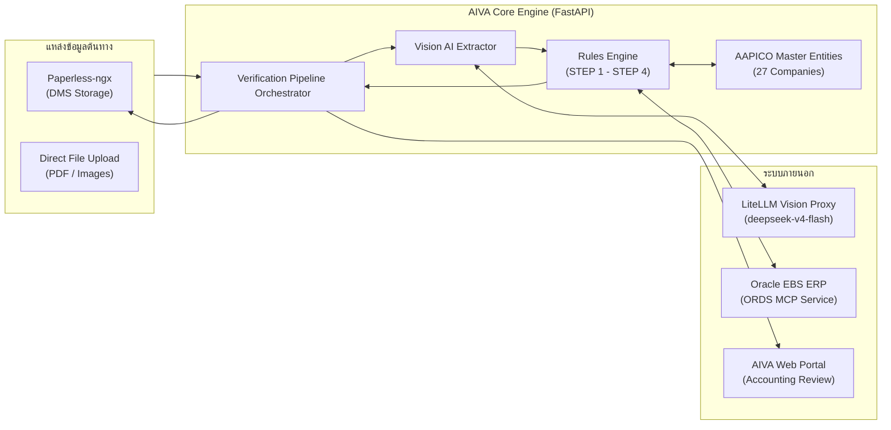
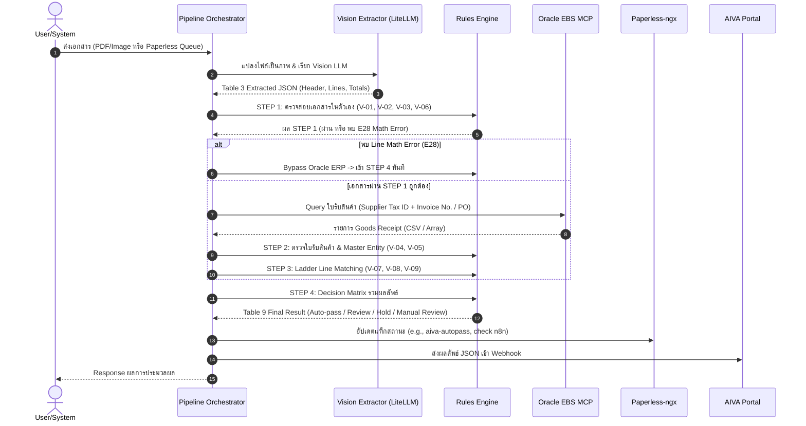

# System Architecture: AIVA PO-Invoice Matching Verification

> **มาตรฐานอ้างอิง:** `AH-IT-DOC-PO-INV-Matching-Standard-v6.2-DRAFT-260930-WT`  
> **Backend Architecture:** Dual-Circuit 3-Way Matching Engine with FastAPI, LiteLLM Vision (`deepseek-v4-flash`), and Oracle EBS ORDS MCP.

---

## 1. ภาพรวมระบบ (System Overview)

ระบบ **AIVA PO-INV Matching Verification System** ทำหน้าที่เป็นตัวกลางตรวจสอบความถูกต้องของเอกสารใบแจ้งหนี้/ใบกำกับภาษี (Invoice / Tax Invoice) และทำการตรวจสอบเทียบแบบ **3-Way Matching** ระหว่าง:
1. **Invoice (ใบแจ้งหนี้/ใบกำกับภาษี)** ที่ผู้ขายส่งมา
2. **Purchase Order (PO - ใบสั่งซื้อ)** ในระบบจัดซื้อ
3. **Goods Receipt (RCV - ใบรับสินค้า)** ในระบบ Oracle EBS ERP

ระบบทำงานแบบ Dual-Circuit เพื่อประสิทธิภาพและความปลอดภัยสูงสุด โดยหากพบความผิดพลาดทางเลขคณิตในระดับบรรทัดของเอกสาร (E28) ระบบจะตัดวงจรไม่เรียก Oracle ERP ทันที เพื่อป้องกันโหลดเกินความจำเป็น

---

## 2. แผนภาพสถาปัตยกรรมระดับสูง (High-Level Architecture)

---

## 3. ส่วนประกอบหลักของระบบ (System Components)

### 3.1 Backend Application (`OCR service/n8n/app/`)
- **FastAPI Core (`main.py`)**: ให้บริการ REST API แบบ Asynchronous ประสิทธิภาพสูง พร้อมทั้ง Serve หน้า Web UI สำหรับ Review เอกสารที่ `/app`
- **Config Management (`config.py`)**: จัดการตัวแปรสภาพแวดล้อมผ่าน Pydantic BaseSettings และ `.env`
- **Domain Models (`core/models.py`)**: กำหนด Data Schema ตามมาตรฐาน:
  - Table 3 Schema: ข้อมูลที่สกัดได้จาก Vision AI
  - Oracle Receipt Schema: โครงสร้างข้อมูลใบรับสินค้าจาก ERP
  - Table 9 Schema: ผลลัพธ์การตรวจสอบสุดท้าย 9 กฎ (V-01 ถึง V-09)
- **Master Data (`core/master_data.py`)**: ข้อมูล 27 บริษัทในเครือ AAPICO (Tax ID 13 หลัก, Inventory Org ID, Operating Unit ID, ที่อยู่ และรหัสไปรษณีย์) สำหรับการตรวจสอบแบบ Exact Match
- **Rules Engine (`core/rules.py`)**: โมดูลตรรกะและคณิตศาสตร์บริสุทธิ์ (Pure Logic) ปราศจาก Side-effect แยกเป็น STEP 1, STEP 2, STEP 3 และ STEP 4

### 3.2 Services & Integrations (`app/services/`)
- **Pipeline Orchestrator (`pipeline.py`)**: ตัวควบคุมวงจรชีวิตการตรวจสอบเอกสารตั้งแต่ Ingestion จนถึง Final Dispatch
- **Vision Extractor (`vision_extractor.py`)**: แปลงหน้าเอกสาร PDF/Image เป็น Base64 แล้วส่งให้ LiteLLM Proxy เพื่อดึงข้อมูล Table 3 JSON
- **Oracle MCP Client (`oracle_mcp.py`)**: เชื่อมต่อไปยัง Oracle EBS ORDS MCP Server ผ่าน JSON-RPC รัน Query วิว `apps.AH_DEV_RCV_PO_AP_MATCHING_V`
- **Paperless Client (`paperless.py`)**: ดึงเอกสารคิวที่ต้องตรวจสอบ (Tag ID 5) และติด Tag หลังตรวจสอบเสร็จ (เช่น Tag ID 12 และ Tag สถานะผลลัพธ์)
- **Portal Dispatcher (`portal.py`)**: ส่งผลลัพธ์ Table 9 JSON ไปยัง AIVA Web Portal Webhook

---

## 4. โฟลว์การประมวลผลเอกสาร 4 ขั้นตอน (The 4-Step Pipeline Flow)

---

## 5. แหล่งอ้างอิงโค้ด (Source Code References)

- [app/main.py](file:///c:/Users/aapico.intern07/Documents/invoice/ai-invoice-matching/OCR%20service/n8n/app/main.py)
- [app/services/pipeline.py](file:///c:/Users/aapico.intern07/Documents/invoice/ai-invoice-matching/OCR%20service/n8n/app/services/pipeline.py)
- [app/core/rules.py](file:///c:/Users/aapico.intern07/Documents/invoice/ai-invoice-matching/OCR%20service/n8n/app/core/rules.py)
- [app/services/oracle_mcp.py](file:///c:/Users/aapico.intern07/Documents/invoice/ai-invoice-matching/OCR%20service/n8n/app/services/oracle_mcp.py)
